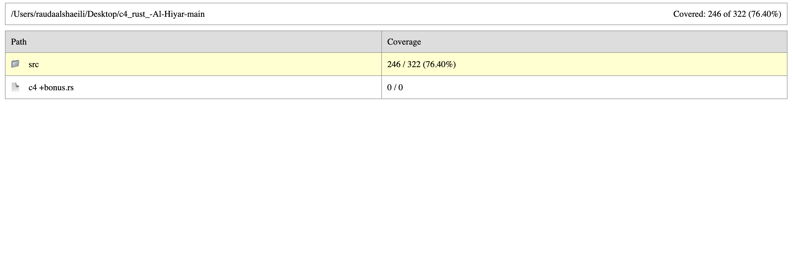

# C4 Rust Compiler

## Project Overview

This project is a Rust-based reimplementation of the original `c4.c` compiler — a minimalist, self-hosting C compiler. The goal was to preserve the functionality of the C version while improving safety, clarity, and extensibility using Rust features.

> **Reference:** This implementation is based on the original [`c4.c`](./c4.c) file provided in the project requirements.

---

## Objectives

- Rewrite the original C4 compiler in idiomatic Rust.
- Use Rust features like `Option`, `Result`, pattern matching, and ownership.
- Achieve functional equivalence including a stack-based virtual machine.
- Implement inline unit tests for core components.
- Add a bonus feature: **Floating‑Point Support**.
- Provide documentation and a comparison report.

---

## Repository Structure

```
c4_rust_-Al-Hiyar/
├── src/                      # Contains main.rs (renamed version of c4.rs for Cargo)
│   └── main.rs
├── target/                   # Contains auto-generated Rust documentation (cargo doc)
├── Cargo.toml                # Rust project manifest
├── c4.rs                     # Core compiler implementation
├── c4 +bonus.rs              # Extended version with floating-point support
├── c4.c                      # Original C reference implementation
├── README.md                 # Project documentation (this file)
├── coverage.png              # Screenshot showing 76.40% tarpaulin coverage
├── tarpaulin-report.html     # Code coverage HTML report
└── c4_rust_comparison.pdf    # Comparison of C vs Rust implementation
```

---

## Build Instructions

```bash
cargo build
```

---

## Running the Compiler

```bash
cargo run -- path/to/code.c
```

This command will:
- Tokenize the source
- Parse it into opcodes
- Execute it using the stack-based virtual machine

---

## Running Unit Tests

```bash
cargo test
```

### Test Coverage

Code coverage is measured using `cargo tarpaulin`. The current test suite achieves **76.40%** line coverage.



To re-generate:

```bash
cargo install cargo-tarpaulin
cargo tarpaulin
```

---

## Bonus Feature: Floating‑Point Support

The bonus version (`c4 +bonus.rs`) extends the compiler to:
- Parse and execute floating-point literals (e.g., `3.14`)
- Add support for `FImm` opcodes
- Handle float arithmetic in the VM (`Add`, `Sub`, `Mul`, `Div`)

### Example:

```c
int main() {
    return 3.14 + 2.0;
}
```

```bash
cargo run -- float_test.c
```

---

## Self-Hosting Capability

```bash
cargo run -- c4.rs
```

If the compiler can process and run its own source, self-hosting is verified.

---

## Additional Documentation

- **Comparison Report:**  
  [`c4_rust_comparison.pdf`](./c4_rust_comparison.pdf) provides a detailed analysis comparing the original C implementation and the rewritten Rust version, covering performance, safety, and challenges.

- **Rust Auto-Generated Docs:**  
  HTML documentation was generated using [`cargo doc --no-deps`](https://doc.rust-lang.org/cargo/commands/cargo-doc.html).  
  You can view it by opening the following file in a browser:

  ```
  target/doc/<crate-name>/index.html
  ```

  Or explore the `target/doc/` folder included in the repository.

---

## Team & Collaboration

This project was collaboratively designed, developed, and reviewed by Rauda Alsheaili and Almaha Alshamsi. Both members contributed equally to planning, writing, testing, and finalizing the C4 Rust Compiler.

---

## Summary

This compiler demonstrates:
- A working translation of C4 to Rust
- Strong test coverage (76.4%)
- Floating-point support as a bonus
- Clear documentation and modular structure
